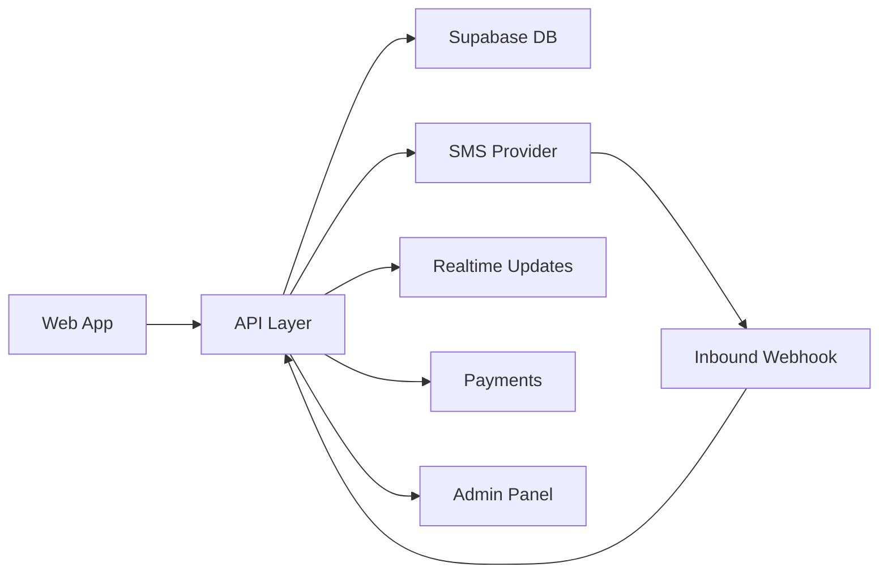

# System Architecture

## High-Level Components

- Next.js web app.
- Authentication and database in Supabase.
- Provider integration service.
- Realtime SMS delivery pipeline.
- Payment processor integration.
- Admin and moderation tools.

## Suggested Architecture

## Service Split

- Public frontend handles browsing, account management, and order creation.
- Backend handles provider calls, price checks, state transitions, and webhook verification.
- Worker jobs handle expiry, cleanup, refund eligibility, and delivery retries.

## Scalability Notes

- Store provider credentials outside the main app.
- Queue long-running tasks.
- Cache catalog and pricing data.
- Use rate limits per user and per IP.
- Keep a provider abstraction layer so vendors can be swapped without rewriting the app.
